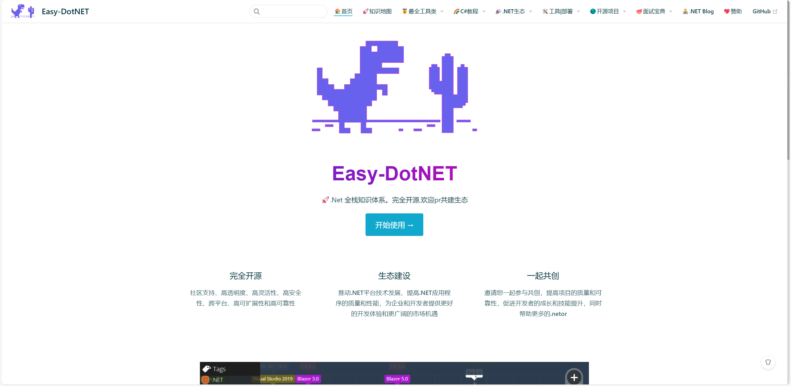

# easy-dotnet
> A Simple Way to Learn. NET（活跃开发者聚集地）

**微信：ygdxg8657 （备注进群） QQ群：903210423（已满）543829648** 

## 介绍
1. 这个开源项目的初衷是打造一个好用的、面向.NET程序员的 **`知识库`**。
2. 轻松构建一个 **`本地资源化`** 的知识库，让你的知识海洋像一本本书一样清晰易读。
3. 你可以在自己的主机上自行部署构建。
4. **`邀请您一起参与共创`**，提高项目的质量和可靠性，促进开发者的成长和技能提升，同时帮助更多的开发者。



## 快速上手

```bash
# clone the project
git clone https://github.com/786744873/easy-dotnet

# enter the project directory
cd easy-dotnet

# install dependency
npm install --registry=https://repo.huaweicloud.com/repository/npm/ # or yarn install

# develop
npm run dev # or yarn dev
```

## ⚡ 反馈与交流

在使用过程中有任何问题和想法，请给我提 [Issue](https://github.com/786744873/easy-dotnet/issues)。你也可以在Issue查看别人提的问题和给出解决方案。

或者加入我们的交流群：参与贡献可以榜上留名💯


